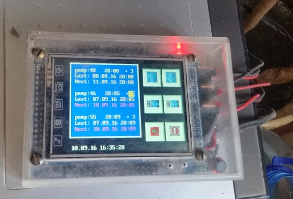

	Water pump controller (Three channels).

Purpose: Watering flowers
Control: LCD Touch Screen

Main hardware:
	Board: “Mini STM32 STM32F103RBT6 Development Board w/ 2.8" TFT LCD Touch Screen”

Additional hardware:
	1.Power Supply 12V 5A
	2.DC/DC 12V->5V
	3.Electronic relays on power MOSFET like IRF3205 + NPN transistor bc817 or “Electronic relay module Arduino”

Water source:
	12V Universal Windscreen Washer Pump Bottle Kit 

